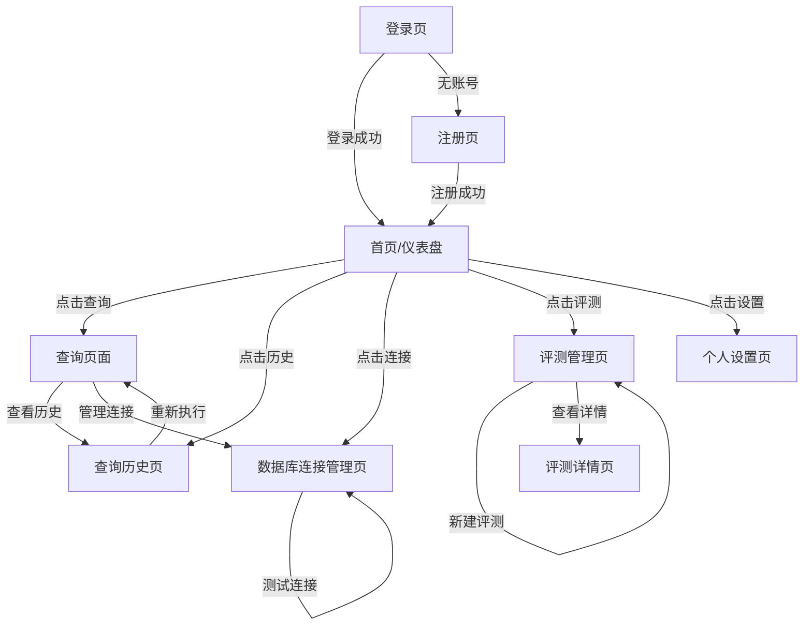

# Text-to-SQL 智能查询系统 - UI设计文档

## 1. 设计概述

### 1.1 设计理念

**简洁高效**：界面设计遵循"少即是多"原则，减少用户认知负担，让非技术人员也能快速上手。

**专业可信**：采用科技感配色和清晰的视觉层次，传达AI驱动的专业形象，建立用户信任。

**即时反馈**：所有操作提供即时视觉反馈，加载状态、成功/失败提示清晰明确。

### 1.2 风格指南

#### 颜色系统

```
主色调：
- Primary: #1677FF (Ant Design Blue) - 主要按钮、链接、高亮
- Primary Hover: #4096FF
- Primary Active: #0958D9

功能色：
- Success: #52C41A - 成功状态、通过指标
- Warning: #FAAD14 - 警告提示
- Error: #FF4D4F - 错误状态、失败指标
- Info: #1677FF - 信息提示

中性色：
- Text Primary: #262626 - 主要文字
- Text Secondary: #595959 - 次要文字
- Text Disabled: #BFBFBF - 禁用文字
- Border: #D9D9D9 - 边框
- Divider: #F0F0F0 - 分割线
- Background: #F5F5F5 - 页面背景
- White: #FFFFFF - 卡片背景
```

#### 字体系统

```
字体族：
- 中文：-apple-system, "PingFang SC", "Microsoft YaHei", sans-serif
- 英文/代码："JetBrains Mono", "Fira Code", Consolas, monospace

字号规范：
- Title: 24px/600 - 页面标题
- H1: 20px/600 - 区块标题
- H2: 16px/600 - 卡片标题
- Body: 14px/400 - 正文
- Small: 12px/400 - 辅助文字
- Code: 13px/400 - 代码展示
```

#### 间距系统

```
基础单位：8px

常用间距：
- xs: 4px
- sm: 8px
- md: 16px
- lg: 24px
- xl: 32px
- xxl: 48px

布局间距：
- 页面内边距: 24px
- 卡片内边距: 24px
- 表单间距: 16px
- 按钮间距: 12px
```

---

## 2. 页面结构

### 2.1 整体布局

采用经典的侧边栏+顶部导航+内容区的三栏布局：

```
┌─────────────────────────────────────────────────────────────┐
│  Logo          面包屑导航                    [用户头像 ▼]   │  ← Header (56px)
├──────────┬──────────────────────────────────────────────────┤
│          │                                                  │
│  [首页]  │                                                  │
│  [查询]  │              Main Content Area                   │
│  [历史]  │                                                  │
│  [连接]  │              (动态内容区域)                       │
│  [评测]  │                                                  │
│          │                                                  │
│  ────────│                                                  │
│  [设置]  │                                                  │
│          │                                                  │
└──────────┴──────────────────────────────────────────────────┘
     ↑              ↑
  Sidebar        Content
  (200px)       (flex: 1)
```

### 2.2 布局组件说明

#### Header (顶部导航栏)
- **高度**: 56px
- **背景**: #FFFFFF
- **阴影**: 0 1px 4px rgba(0,0,0,0.05)
- **左侧**: Logo + 面包屑导航
- **右侧**: 通知图标 + 用户头像下拉菜单

#### Sidebar (侧边导航栏)
- **宽度**: 200px (可折叠至64px)
- **背景**: #001529 (深色主题)
- **菜单项**: 图标 + 文字
- **激活态**: 背景色变化 + 左侧高亮条

#### Content (内容区)
- **背景**: #F5F5F5
- **内边距**: 24px
- **最小高度**: calc(100vh - 56px)

---

## 3. 页面详细设计

### 3.1 登录/注册页

#### 页面目的
用户身份验证入口，支持账号密码登录和注册新账号。

#### 布局描述

```
┌─────────────────────────────────────────────────────────────┐
│                                                             │
│                                                             │
│          ┌─────────────────────────────────────┐            │
│          │                                     │            │
│          │        [Logo] Text2SQL              │            │
│          │                                     │            │
│          │     智能查询，让数据触手可及          │            │
│          │                                     │            │
│          │  ┌───────────────────────────────┐  │            │
│          │  │  账号                         │  │            │
│          │  │  ┌─────────────────────────┐  │  │            │
│          │  │  │ 请输入邮箱/用户名        │  │  │            │
│          │  │  └─────────────────────────┘  │  │            │
│          │  └───────────────────────────────┘  │            │
│          │                                     │            │
│          │  ┌───────────────────────────────┐  │            │
│          │  │  密码                         │  │            │
│          │  │  ┌─────────────────────────┐  │  │            │
│          │  │  │ ***************    [👁] │  │  │            │
│          │  │  └─────────────────────────┘  │  │            │
│          │  └───────────────────────────────┘  │            │
│          │                                     │            │
│          │  [ ] 记住我        忘记密码?        │            │
│          │                                     │            │
│          │  ┌───────────────────────────────┐  │            │
│          │  │         登   录               │  │            │
│          │  └───────────────────────────────┘  │            │
│          │                                     │            │
│          │  ─────────── 或 ───────────        │            │
│          │                                     │            │
│          │  [G] Google  [Git] GitHub          │            │
│          │                                     │            │
│          │  还没有账号?  [立即注册]            │            │
│          │                                     │            │
│          └─────────────────────────────────────┘            │
│                                                             │
│                                                             │
└─────────────────────────────────────────────────────────────┘
                    背景: 渐变蓝紫色
```

#### 元素说明

| 元素 | 类型 | 说明 |
|------|------|------|
| Logo | 图片+文字 | 系统Logo + "Text2SQL" 标题 |
| 账号输入框 | Input | 支持邮箱/用户名，带前缀图标 |
| 密码输入框 | Input.Password | 支持显示/隐藏密码 |
| 记住我 | Checkbox | 本地保存登录状态 |
| 忘记密码 | Link | 跳转密码重置页 |
| 登录按钮 | Button | Primary类型，全宽 |
| 第三方登录 | Button.Group | Google、GitHub快捷登录 |
| 注册链接 | Link | 切换至注册表单 |

#### 交互说明

1. **表单验证**:
   - 账号：必填，邮箱格式验证
   - 密码：必填，最少6位
   - 验证失败时输入框变红，下方显示错误提示

2. **登录按钮**:
   - 点击后显示加载状态（Loading spinner）
   - 登录成功：跳转至首页
   - 登录失败：显示错误提示（Toast）

3. **注册切换**:
   - 点击"立即注册"切换表单
   - 注册表单增加"确认密码"字段

---

### 3.2 首页/仪表盘

#### 页面目的
展示系统概览，提供快捷入口和数据统计。

#### 布局描述

```
┌─────────────────────────────────────────────────────────────┐
│  首页                                                        │
├─────────────────────────────────────────────────────────────┤
│                                                             │
│  ┌─────────────┐ ┌─────────────┐ ┌─────────────┐ ┌────────┐ │
│  │             │ │             │ │             │ │        │ │
│  │  今日查询   │ │  成功率     │ │  活跃连接   │ │  历史  │ │
│  │    128     │ │   96.5%    │ │     5      │ │  1,234 │ │
│  │   ↑ 12%    │ │   ↑ 2.3%   │ │   → 0%     │ │ ↑ 56   │ │
│  │             │ │             │ │             │ │        │ │
│  └─────────────┘ └─────────────┘ └─────────────┘ └────────┘ │
│                                                             │
│  ┌─────────────────────────────────┐ ┌─────────────────────┐│
│  │                                 │ │                     ││
│  │   开始查询                        │ │   最近查询历史       ││
│  │                                 │ │                     ││
│  │   ┌─────────────────────────┐   │ │ ┌─────────────────┐ ││
│  │   │                         │   │ │ │ [图标] 查询1    │ ││
│  │   │  输入您的问题...         │   │ │ │ 2分钟前  [→]   │ ││
│  │   │                         │   │ │ └─────────────────┘ ││
│  │   └─────────────────────────┘   │ │ ┌─────────────────┐ ││
│  │                                 │ │ │ [图标] 查询2    │ ││
│  │   示例：                        │ │ │ 1小时前  [→]   │ ││
│  │   "查询上个月的销售额"           │ │ └─────────────────┘ ││
│  │   "统计每个部门的员工数量"        │ │ ┌─────────────────┐ ││
│  │   "找出库存低于10的商品"          │ │ │ [图标] 查询3    │ ││
│  │                                 │ │ │ 昨天  [→]      │ ││
│  │   [开始查询]                    │ │ └─────────────────┘ ││
│  │                                 │ │                     ││
│  │                                 │ │ [查看全部历史 →]   ││
│  │                                 │ │                     ││
│  └─────────────────────────────────┘ └─────────────────────┘│
│                                                             │
│  ┌─────────────────────────────────────────────────────────┐│
│  │                                                         ││
│  │  常用数据库连接                                          ││
│  │                                                         ││
│  │  ┌────────┐ ┌────────┐ ┌────────┐ ┌────────┐ ┌───────┐ ││
│  │  │[MySQL] │ │[PG]    │ │[SQLite]│ │[MySQL] │ │  +    │ ││
│  │  │生产库  │ │测试库  │ │本地    │ │开发库  │ │ 添加  │ ││
│  │  │ ● 在线 │ │ ● 在线 │ │ ● 离线│ │ ● 在线 │ │ 连接  │ ││
│  │  └────────┘ └────────┘ └────────┘ └────────┘ └───────┘ ││
│  │                                                         ││
│  └─────────────────────────────────────────────────────────┘│
│                                                             │
└─────────────────────────────────────────────────────────────┘
```

#### 元素说明

**统计卡片区域**:
| 元素 | 说明 |
|------|------|
| 今日查询 | 当日查询次数，带环比变化 |
| 成功率 | SQL生成成功率，带环比变化 |
| 活跃连接 | 当前配置的数据库连接数 |
| 历史查询 | 累计查询总数 |

**快捷查询区**:
| 元素 | 说明 |
|------|------|
| 输入框 | 大输入框，支持多行，placeholder提示 |
| 示例问题 | 可点击快速填充输入框 |
| 开始查询按钮 | 跳转至查询页面并携带输入内容 |

**最近历史区**:
| 元素 | 说明 |
|------|------|
| 历史列表 | 显示最近3-5条查询记录 |
| 快捷操作 | 点击可直接重新执行该查询 |
| 查看全部 | 跳转至历史记录页 |

**连接快捷区**:
| 元素 | 说明 |
|------|------|
| 连接卡片 | 显示连接名称、类型图标、状态指示 |
| 状态指示 | 绿点=在线，红点=离线 |
| 添加按钮 | 跳转至连接管理页 |

#### 交互说明

1. **统计卡片**:
   - 数字加载动画（从0增长到目标值）
   - hover时显示详细tooltip

2. **快捷查询**:
   - 输入框聚焦时展开，显示更多示例
   - 点击示例自动填充并跳转

3. **历史记录**:
   - hover显示操作按钮（重新执行、收藏、删除）
   - 点击整行跳转至查询结果页

4. **连接卡片**:
   - hover显示连接详情tooltip
   - 点击跳转至对应数据库的查询页

---

### 3.3 查询页面（核心页面）

#### 页面目的
自然语言转SQL的核心功能页面，支持输入问题、生成SQL、执行查询、展示结果。

#### 布局描述

```
┌─────────────────────────────────────────────────────────────┐
│  查询                                        [?帮助] [反馈] │
├─────────────────────────────────────────────────────────────┤
│                                                             │
│  ┌──────────────┐  ┌──────────────────────────────────────┐ │
│  │              │  │                                      │ │
│  │  数据库选择   │  │         对话历史区域                  │ │
│  │  ▼ 生产库    │  │                                      │ │
│  │              │  │  ┌────────────────────────────────┐  │ │
│  │  ─────────── │  │  │ [用户] 查询上个月的订单总额      │  │ │
│  │              │  │  │                                │  │ │
│  │  表结构预览   │  │  │ [AI] 已为您生成SQL：            │  │ │
│  │  ▼ orders    │  │  │ ┌────────────────────────────┐ │  │ │
│  │    ├ id      │  │  │ │ SELECT SUM(total_amount)   │ │  │ │
│  │    ├ user_id │  │  │ │ FROM orders                │ │  │ │
│  │    ├ status  │  │  │ │ WHERE order_date >=        │ │  │ │
│  │    └ ...     │  │  │ │   DATE_SUB(NOW(), INTERVAL │ │  │ │
│  │  ▼ users     │  │  │ │   1 MONTH)                 │ │  │ │
│  │    ├ id      │  │  │ └────────────────────────────┘ │  │ │
│  │    ├ name    │  │  │ [执行] [复制] [编辑]           │  │ │
│  │    └ ...     │  │  │                                │  │ │
│  │              │  │  │ 执行结果 (12行, 0.3s)：         │  │ │
│  │              │  │  │ ┌──────────────┐               │  │ │
│  │              │  │  │ │ total_amount │               │  │ │
│  │              │  │  │ ├──────────────┤               │  │ │
│  │              │  │  │ │ ¥158,432.00  │               │  │ │
│  │              │  │  │ └──────────────┘               │  │ │
│  │              │  │  │ [导出CSV] [导出JSON]           │  │ │
│  │              │  │  └────────────────────────────────┘  │ │
│  │              │  │                                      │ │
│  └──────────────┘  └──────────────────────────────────────┘ │
│                                                             │
│  ┌─────────────────────────────────────────────────────────┐│
│  │                                                         ││
│  │  [?] 输入您的问题...                      [发送] [清空] ││
│  │                                                         ││
│  └─────────────────────────────────────────────────────────┘│
│                                                             │
└─────────────────────────────────────────────────────────────┘
```

#### 元素说明

**左侧边栏**:
| 元素 | 说明 |
|------|------|
| 数据库选择器 | Dropdown，显示当前所有连接 |
| 表结构树 | 可展开的树形结构，显示表和字段 |
| 字段信息 | hover显示字段类型、注释 |

**对话历史区**:
| 元素 | 说明 |
|------|------|
| 用户消息 | 右侧对齐，显示用户输入的自然语言 |
| AI消息 | 左侧对齐，包含生成的SQL和结果 |
| SQL代码块 | 语法高亮，支持行号显示 |
| 操作按钮 | 执行、复制、编辑SQL |
| 结果表格 | 分页展示查询结果 |

**底部输入区**:
| 元素 | 说明 |
|------|------|
| 输入框 | Textarea，支持多行输入 |
| 发送按钮 | Primary按钮，带发送图标 |
| 清空按钮 | 清空当前对话历史 |

#### 交互说明

1. **数据库切换**:
   - 切换时重新加载对应schema
   - 显示加载状态

2. **SQL代码块**:
   - 点击复制按钮：复制SQL到剪贴板，显示成功提示
   - 点击编辑按钮：进入SQL编辑模式
   - 语法高亮：关键字、函数、字符串不同颜色

3. **执行按钮**:
   - 点击后显示加载状态
   - 执行成功：展示结果表格
   - 执行失败：显示错误信息（红色提示框）

4. **结果表格**:
   - 支持列宽调整
   - 支持排序（点击表头）
   - 分页显示（默认20条/页）
   - 导出按钮：下载CSV/JSON

5. **多轮对话**:
   - 支持追问，如"只看上个月的"
   - 上下文自动关联

---

### 3.4 数据库连接管理页

#### 页面目的
管理数据库连接，支持添加、编辑、删除、测试连接。

#### 布局描述

```
┌─────────────────────────────────────────────────────────────┐
│  数据库连接管理                              [+ 新建连接]   │
├─────────────────────────────────────────────────────────────┤
│                                                             │
│  ┌─────────────────────────────────────────────────────────┐│
│  │  [全部 ▼] [搜索... ]                    [刷新]          ││
│  └─────────────────────────────────────────────────────────┘│
│                                                             │
│  ┌─────────────┐ ┌─────────────┐ ┌─────────────┐ ┌────────┐ │
│  │ [MySQL图标] │ │ [PG图标]    │ │ [SQLite图标]│ │[MySQL] │ │
│  │             │ │             │ │             │ │        │ │
│  │  生产数据库  │ │  测试数据库  │ │  本地开发   │ │ 开发库 │ │
│  │  MySQL 8.0  │ │ PostgreSQL  │ │  SQLite     │ │ MySQL  │ │
│  │             │ │             │ │             │ │        │ │
│  │ ● 在线      │ │ ● 在线      │ │ ● 离线      │ │ ● 在线 │ │
│  │ 上次使用:   │ │ 上次使用:   │ │ 上次使用:   │ │ 上次:  │ │
│  │ 2分钟前     │ │ 1小时前     │ │ 3天前       │ │ 1天前  │ │
│  │             │ │             │ │             │ │        │ │
│  │ [编辑][删除]│ │ [编辑][删除]│ │ [编辑][删除]│ │ [编辑] │ │
│  │ [测试]      │ │ [测试]      │ │ [测试]      │ │ [删除] │ │
│  └─────────────┘ └─────────────┘ └─────────────┘ └────────┘ │
│                                                             │
└─────────────────────────────────────────────────────────────┘
```

**添加/编辑连接弹窗**:

```
┌─────────────────────────────────────┐
│  新建数据库连接              [×]    │
├─────────────────────────────────────┤
│                                     │
│  连接名称 *                         │
│  ┌─────────────────────────────┐    │
│  │ 生产数据库                   │    │
│  └─────────────────────────────┘    │
│                                     │
│  数据库类型 *                       │
│  ┌─────────────────────────────┐    │
│  │ ▼ MySQL                     │    │
│  └─────────────────────────────┘    │
│                                     │
│  主机地址 *                         │
│  ┌─────────────────────────────┐    │
│  │ localhost                   │    │
│  └─────────────────────────────┘    │
│                                     │
│  端口 *                             │
│  ┌─────────────────────────────┐    │
│  │ 3306                        │    │
│  └─────────────────────────────┘    │
│                                     │
│  数据库名 *                         │
│  ┌─────────────────────────────┐    │
│  │ my_database                 │    │
│  └─────────────────────────────┘    │
│                                     │
│  用户名 *                           │
│  ┌─────────────────────────────┐    │
│  │ root                        │    │
│  └─────────────────────────────┘    │
│                                     │
│  密码                               │
│  ┌─────────────────────────────┐    │
│  │ ***************        [👁] │    │
│  └─────────────────────────────┘    │
│                                     │
│  [ ] 使用SSL连接                    │
│  [ ] 只读模式（推荐生产环境）        │
│                                     │
│  ┌─────────────┐ ┌─────────────┐    │
│  │  测试连接   │ │   保  存    │    │
│  └─────────────┘ └─────────────┘    │
│                                     │
└─────────────────────────────────────┘
```

#### 元素说明

**连接卡片**:
| 元素 | 说明 |
|------|------|
| 数据库图标 | 根据类型显示不同图标（MySQL、PG、SQLite） |
| 连接名称 | 用户自定义的名称 |
| 数据库类型 | 显示具体版本 |
| 状态指示 | 绿点=在线，红点=离线，灰点=未测试 |
| 操作按钮 | 编辑、删除、测试连接 |

**连接表单**:
| 字段 | 必填 | 说明 |
|------|------|------|
| 连接名称 | 是 | 用户自定义，如"生产数据库" |
| 数据库类型 | 是 | MySQL/PostgreSQL/SQLite |
| 主机地址 | 是 | IP或域名 |
| 端口 | 是 | 默认端口自动填充 |
| 数据库名 | 是 | 数据库名称 |
| 用户名 | 是 | 连接账号 |
| 密码 | 否 | 连接密码 |
| SSL连接 | 否 | 是否使用SSL/TLS |
| 只读模式 | 否 | 限制为只读权限 |

#### 交互说明

1. **测试连接**:
   - 点击后显示加载状态
   - 成功：显示绿色提示"连接成功"
   - 失败：显示红色提示具体错误

2. **删除确认**:
   - 点击删除弹出确认对话框
   - 确认后才执行删除

3. **表单验证**:
   - 实时验证必填项
   - 保存前验证所有必填字段

---

### 3.5 查询历史页

#### 页面目的
查看和管理历史查询记录，支持搜索、筛选、收藏、重新执行。

#### 布局描述

```
┌─────────────────────────────────────────────────────────────┐
│  查询历史                                                   │
├─────────────────────────────────────────────────────────────┤
│                                                             │
│  ┌─────────────────────────────────────────────────────────┐│
│  │ [搜索查询...] [数据库 ▼] [时间 ▼] [状态 ▼] [收藏 ▼]    ││
│  └─────────────────────────────────────────────────────────┘│
│                                                             │
│  ┌─────────────────────────────────────────────────────────┐│
│  │                                                         ││
│  │  ┌─────────────────────────────────────────────────┐    ││
│  │  │ [★] 查询上个月的销售额                            │    ││
│  │  │                                                 │    ││
│  │  │ SELECT SUM(amount) FROM orders...              │    ││
│  │  │                                                 │    ││
│  │  │ 生产库 • 2小时前 • 执行成功 • 耗时0.5s          │    ││
│  │  │                                                 │    ││
│  │  │ [重新执行] [查看详情] [取消收藏] [删除]          │    ││
│  │  └─────────────────────────────────────────────────┘    ││
│  │                                                         ││
│  │  ┌─────────────────────────────────────────────────┐    ││
│  │  │ [☆] 统计每个部门的员工数量                        │    ││
│  │  │                                                 │    ││
│  │  │ SELECT d.name, COUNT(e.id)...                    │    ││
│  │  │                                                 │    ││
│  │  │ 测试库 • 昨天 • 执行成功 • 耗时1.2s             │    ││
│  │  │                                                 │    ││
│  │  │ [重新执行] [查看详情] [收藏] [删除]              │    ││
│  │  └─────────────────────────────────────────────────┘    ││
│  │                                                         ││
│  │  ┌─────────────────────────────────────────────────┐    ││
│  │  │ [☆] 查找库存为负数的商品                          │    ││
│  │  │                                                 │    ││
│  │  │ SELECT * FROM products WHERE stock < 0          │    ││
│  │  │                                                 │    ││
│  │  │ 开发库 • 3天前 • 执行失败 • 表不存在             │    ││
│  │  │                                                 │    ││
│  │  │ [重新执行] [查看详情] [收藏] [删除]              │    ││
│  │  └─────────────────────────────────────────────────┘    ││
│  │                                                         ││
│  └─────────────────────────────────────────────────────────┘│
│                                                             │
│  ┌─────────────────────────────────────────────────────────┐│
│  │              < 1 2 3 4 5 ... 10 >                       ││
│  └─────────────────────────────────────────────────────────┘│
│                                                             │
└─────────────────────────────────────────────────────────────┘
```

#### 元素说明

**筛选栏**:
| 元素 | 说明 |
|------|------|
| 搜索框 | 按自然语言或SQL内容搜索 |
| 数据库筛选 | 按数据库连接筛选 |
| 时间筛选 | 今天/本周/本月/全部 |
| 状态筛选 | 成功/失败/全部 |
| 收藏筛选 | 仅显示收藏 |

**历史记录卡片**:
| 元素 | 说明 |
|------|------|
| 收藏标记 | ★已收藏，☆未收藏，可点击切换 |
| 自然语言 | 用户输入的问题 |
| SQL预览 | 前2-3行SQL |
| 元信息 | 数据库、时间、状态、耗时 |
| 操作按钮 | 重新执行、查看详情、收藏/取消、删除 |

#### 交互说明

1. **筛选联动**:
   - 多个筛选条件组合生效
   - 筛选后自动刷新列表

2. **收藏切换**:
   - 点击星标即时切换收藏状态
   - 显示操作成功提示

3. **重新执行**:
   - 跳转至查询页面
   - 自动填充原问题和数据库

4. **查看详情**:
   - 展开/弹窗显示完整信息
   - 包括完整SQL和查询结果

---

### 3.6 评测管理页

#### 页面目的
管理Text-to-SQL模型评测任务，查看评测结果和对比分析。

#### 布局描述 - 评测任务列表

```
┌─────────────────────────────────────────────────────────────┐
│  评测管理                                    [+ 新建评测]   │
├─────────────────────────────────────────────────────────────┤
│                                                             │
│  ┌─────────────────────────────────────────────────────────┐│
│  │  评测概览                                                ││
│  │                                                         ││
│  │  ┌─────────────┐ ┌─────────────┐ ┌─────────────┐        ││
│  │  │  总评测数   │ │  平均EX分数 │ │  最近评测   │        ││
│  │  │    15      │ │   62.3%    │ │  2小时前    │        ││
│  │  └─────────────┘ └─────────────┘ └─────────────┘        ││
│  └─────────────────────────────────────────────────────────┘│
│                                                             │
│  ┌─────────────────────────────────────────────────────────┐│
│  │  [搜索...] [数据集 ▼] [状态 ▼]           [刷新]         ││
│  └─────────────────────────────────────────────────────────┘│
│                                                             │
│  ┌─────────────────────────────────────────────────────────┐│
│  │                                                         ││
│  │  ┌─────────────────────────────────────────────────┐    ││
│  │  │ BIRD-dev 评测 - GPT-4                           │    ││
│  │  │                                                 │    ││
│  │  │ 数据集: BIRD-dev (1,534条)                      │    ││
│  │  │ 模型: gpt-4-1106-preview                        │    ││
│  │  │ EX准确率: 68.5% (1051/1534)                     │    ││
│  │  │                                                 │    ││
│  │  │ ████████████████████░░░░░ 68.5%                │    ││
│  │  │                                                 │    ││
│  │  │ 耗时: 45分钟 • 2小时前完成 • 状态: 已完成        │    ││
│  │  │                                                 │    ││
│  │  │ [查看详情] [导出报告] [对比] [删除]              │    ││
│  │  └─────────────────────────────────────────────────┘    ││
│  │                                                         ││
│  │  ┌─────────────────────────────────────────────────┐    ││
│  │  │ BIRD-dev 评测 - Claude-3                        │    ││
│  │  │                                                 │    ││
│  │  │ 数据集: BIRD-dev (1,534条)                      │    ││
│  │  │ 模型: claude-3-opus-20240229                    │    ││
│  │  │ EX准确率: 71.2% (1092/1534)                     │    ││
│  │  │                                                 │    ││
│  │  │ █████████████████████░░░░ 71.2%                │    ││
│  │  │                                                 │    ││
│  │  │ 耗时: 52分钟 • 昨天完成 • 状态: 已完成           │    ││
│  │  │                                                 │    ││
│  │  │ [查看详情] [导出报告] [对比] [删除]              │    ││
│  │  └─────────────────────────────────────────────────┘    ││
│  │                                                         ││
│  └─────────────────────────────────────────────────────────┘│
│                                                             │
└─────────────────────────────────────────────────────────────┘
```

#### 布局描述 - 评测详情页

```
┌─────────────────────────────────────────────────────────────┐
│  [< 返回] BIRD-dev 评测 - GPT-4                             │
├─────────────────────────────────────────────────────────────┤
│                                                             │
│  ┌─────────────────────────────────────────────────────────┐│
│  │  评测配置                                                ││
│  │  数据集: BIRD-dev | 模型: gpt-4-1106-preview            ││
│  │  评估模式: 标准 | 样本数: 1,534 | 并行数: 4             ││
│  └─────────────────────────────────────────────────────────┘│
│                                                             │
│  ┌─────────────┐ ┌─────────────┐ ┌─────────────┐ ┌────────┐ │
│  │   EX分数    │ │   正确数    │ │   错误数    │ │  耗时  │ │
│  │   68.5%    │ │  1,051     │ │    483     │ │  45min │ │
│  └─────────────┘ └─────────────┘ └─────────────┘ └────────┘ │
│                                                             │
│  ┌─────────────────────────────────────────────────────────┐│
│  │  准确率分布                                              ││
│  │  ┌─────────────────────────────────────────────────┐    ││
│  │  │  简单: 85% ████████████████████████░░░░ 340/400 │    ││
│  │  │  中等: 65% █████████████████░░░░░░░░░░░ 455/700 │    ││
│  │  │  困难: 45% ██████████████████████░░░░░░ 256/434 │    ││
│  │  └─────────────────────────────────────────────────┘    ││
│  └─────────────────────────────────────────────────────────┘│
│                                                             │
│  ┌─────────────────────────────────────────────────────────┐│
│  │  正确样例                                    [查看全部] ││
│  │  ┌─────────────────────────────────────────────────┐    ││
│  │  │ 问题: 查询2023年销售额最高的前5个产品            │    ││
│  │  │ 预测SQL: SELECT product_id, SUM(amount)...       │    ││
│  │  │ 状态: ✓ 执行结果匹配                             │    ││
│  │  │ [查看详情]                                       │    ││
│  │  └─────────────────────────────────────────────────┘    ││
│  └─────────────────────────────────────────────────────────┘│
│                                                             │
│  ┌─────────────────────────────────────────────────────────┐│
│  │  错误样例                                    [查看全部] ││
│  │  ┌─────────────────────────────────────────────────┐    ││
│  │  │ 问题: 统计每个部门工资高于平均值的员工数         │    ││
│  │  │ 预测SQL: SELECT dept_id, COUNT(*)...             │    ││
│  │  │ 错误: 子查询逻辑错误                             │    ││
│  │  │ [查看详情] [重新测试]                            │    ││
│  │  └─────────────────────────────────────────────────┘    ││
│  └─────────────────────────────────────────────────────────┘│
│                                                             │
└─────────────────────────────────────────────────────────────┘
```

#### 新建评测弹窗

```
┌─────────────────────────────────────┐
│  新建评测任务                [×]    │
├─────────────────────────────────────┤
│                                     │
│  任务名称 *                         │
│  ┌─────────────────────────────┐    │
│  │ BIRD-dev 评测               │    │
│  └─────────────────────────────┘    │
│                                     │
│  数据集 *                           │
│  ┌─────────────────────────────┐    │
│  │ ▼ BIRD-dev                  │    │
│  └─────────────────────────────┘    │
│                                     │
│  模型 *                             │
│  ┌─────────────────────────────┐    │
│  │ ▼ gpt-4-1106-preview        │    │
│  └─────────────────────────────┘    │
│                                     │
│  评估模式                           │
│  ○ 标准 (EX)  ● pass@k  ○ 多数投票 │
│                                     │
│  样本数 (k)                         │
│  ┌─────────────────────────────┐    │
│  │ 1                           │    │
│  └─────────────────────────────┘    │
│                                     │
│  并行进程数                         │
│  ┌─────────────────────────────┐    │
│  │ 4                           │    │
│  └─────────────────────────────┘    │
│                                     │
│  高级选项                           │
│  [ ] 使用 Schema 增强               │
│  [ ] 包含 few-shot 示例             │
│  [ ] 温度: 0.0                      │
│                                     │
│  ┌─────────────────────────────┐    │
│  │         开 始 评 测         │    │
│  └─────────────────────────────┘    │
│                                     │
└─────────────────────────────────────┘
```

#### 元素说明

**评测卡片**:
| 元素 | 说明 |
|------|------|
| 任务名称 | 用户自定义或自动生成 |
| 数据集 | 评测使用的数据集 |
| 模型 | 使用的LLM模型 |
| EX准确率 | 执行准确率百分比 |
| 进度条 | 可视化准确率 |
| 元信息 | 耗时、完成时间、状态 |

**评测详情**:
| 元素 | 说明 |
|------|------|
| 统计卡片 | EX分数、正确/错误数、耗时 |
| 难度分布 | 按简单/中等/困难分类统计 |
| 样例列表 | 正确/错误案例分析 |

#### 交互说明

1. **新建评测**:
   - 表单验证必填项
   - 开始评测后跳转至详情页
   - 实时显示评测进度

2. **评测进行中**:
   - 显示进度条和已处理数量
   - 支持取消任务

3. **查看详情**:
   - 展开完整评测信息
   - 支持导出JSON/Excel报告

4. **对比功能**:
   - 多选评测任务
   - 生成对比图表

---

### 3.7 个人设置页

#### 页面目的
管理个人信息、API密钥、系统偏好设置。

#### 布局描述

```
┌─────────────────────────────────────────────────────────────┐
│  个人设置                                                   │
├─────────────────────────────────────────────────────────────┤
│                                                             │
│  ┌──────────────────┐ ┌───────────────────────────────────┐ │
│  │                  │ │                                   │ │
│  │   个人信息        │ │  基本信息                          │ │
│  │   ─────────      │ │                                   │ │
│  │   账户安全        │ │  头像: [图片] [更换]              │ │
│  │   ─────────      │ │                                   │ │
│  │   API密钥         │ │  用户名: 张三                      │ │
│  │   ─────────      │ │  邮箱: zhangsan@example.com        │ │
│  │   外观设置        │ │  角色: 数据分析师                  │ │
│  │   ─────────      │ │                                   │ │
│  │   通知设置        │ │  [编辑信息]                        │ │
│  │                  │ │                                   │ │
│  └──────────────────┘ └───────────────────────────────────┘ │
│                                                             │
│                       ┌───────────────────────────────────┐ │
│                       │  修改密码                          │ │
│                       │                                   │ │
│                       │  当前密码: ************          │ │
│                       │  新密码: ************            │ │
│                       │  确认密码: ************          │ │
│                       │                                   │ │
│                       │  [更新密码]                        │ │
│                       │                                   │ │
│                       └───────────────────────────────────┘ │
│                                                             │
│                       ┌───────────────────────────────────┐ │
│                       │  API密钥配置                       │ │
│                       │                                   │ │
│                       │  OpenAI API Key                   │ │
│                       │  ┌─────────────────────────────┐  │ │
│                       │  │ sk-********************** │  │ │
│                       │  └─────────────────────────────┘  │ │
│                       │                                   │ │
│                       │  阿里云 DashScope Key             │ │
│                       │  ┌─────────────────────────────┐  │ │
│                       │  │ sk-********************** │  │ │
│                       │  └─────────────────────────────┘  │ │
│                       │                                   │ │
│                       │  [保存密钥]                        │ │
│                       │                                   │ │
│                       └───────────────────────────────────┘ │
│                                                             │
│                       ┌───────────────────────────────────┐ │
│                       │  外观设置                          │ │
│                       │                                   │ │
│                       │  主题: ○ 浅色  ● 深色  ○ 跟随系统 │ │
│                       │                                   │ │
│                       │  语言: ┌─────────────┐            │ │
│                       │        │ ▼ 简体中文  │            │ │
│                       │        └─────────────┘            │ │
│                       │                                   │ │
│                       │  [保存设置]                        │ │
│                       │                                   │ │
│                       └───────────────────────────────────┘ │
│                                                             │
└─────────────────────────────────────────────────────────────┘
```

#### 元素说明

**左侧菜单**:
| 菜单项 | 内容 |
|--------|------|
| 个人信息 | 头像、用户名、邮箱、角色 |
| 账户安全 | 修改密码 |
| API密钥 | LLM服务API配置 |
| 外观设置 | 主题、语言 |
| 通知设置 | 邮件/站内通知开关 |

**API密钥配置**:
| 字段 | 说明 |
|------|------|
| OpenAI API Key | 用于GPT系列模型 |
| 阿里云 DashScope | 用于通义千问模型 |
| 本地模型Endpoint | 自定义vLLM地址 |

#### 交互说明

1. **头像更换**:
   - 点击上传图片
   - 支持裁剪预览

2. **API密钥**:
   - 默认显示掩码
   - 点击眼睛图标显示明文
   - 保存后加密存储

3. **主题切换**:
   - 即时生效，无需刷新

---

## 4. 页面跳转逻辑

### 4.1 页面流转图



### 4.2 路由表

| 路由 | 页面 | 权限 |
|------|------|------|
| /login | 登录页 | 公开 |
| /register | 注册页 | 公开 |
| / | 首页 | 登录 |
| /query | 查询页面 | 登录 |
| /history | 查询历史 | 登录 |
| /connections | 连接管理 | 登录 |
| /evaluation | 评测管理 | 登录 |
| /evaluation/:id | 评测详情 | 登录 |
| /settings | 个人设置 | 登录 |

---

## 5. 组件规范

### 5.1 按钮规范

```
Primary Button:
- 背景: #1677FF
- 文字: #FFFFFF
- 圆角: 6px
- 高度: 32px (默认) / 40px (大)
- Padding: 0 16px
- Hover: #4096FF
- Active: #0958D9
- Disabled: #D9D9D9

Default Button:
- 背景: #FFFFFF
- 边框: 1px solid #D9D9D9
- 文字: #262626
- Hover: #F5F5F5

Text Button:
- 背景: transparent
- 文字: #1677FF
- Hover: rgba(22, 119, 255, 0.06)

Danger Button:
- 背景: #FF4D4F
- 文字: #FFFFFF
```

### 5.2 表单规范

```
Input:
- 高度: 32px
- 边框: 1px solid #D9D9D9
- 圆角: 6px
- Padding: 0 12px
- Focus: border-color #1677FF, box-shadow 0 0 0 2px rgba(22,119,255,0.1)
- Error: border-color #FF4D4F

Textarea:
- 最小高度: 64px
- 其他同Input

Select:
- 同Input样式
- Dropdown: 白色背景，阴影

Checkbox/Radio:
- 尺寸: 16x16px
- 选中: #1677FF
```

### 5.3 表格规范

```
Table:
- 表头背景: #FAFAFA
- 表头文字: #262626, 500 weight
- 行高: 48px
- 边框: 1px solid #F0F0F0
- Hover: #FAFAFA
- 选中: rgba(22, 119, 255, 0.04)

Pagination:
- 位置: 右对齐
- 样式: 简洁分页器
```

### 5.4 弹窗规范

```
Modal:
- 宽度: 520px (默认) / 720px (大)
- 圆角: 8px
- 阴影: 0 6px 16px rgba(0,0,0,0.08)
- 遮罩: rgba(0,0,0,0.45)
- 标题: 16px, 500 weight
- 内容Padding: 24px
- 底部按钮: 右对齐

Confirm:
- 宽度: 400px
- 带图标: Warning/Info
- 按钮: 取消 + 确认
```

### 5.5 代码展示规范

```
Code Block:
- 字体: JetBrains Mono, 13px
- 背景: #F6F8FA
- 边框: 1px solid #E1E4E8
- 圆角: 6px
- 行号: 灰色，右对齐
- 语法高亮:
  - 关键字: #CF222E (红)
  - 字符串: #0A3069 (蓝)
  - 函数: #8250DF (紫)
  - 注释: #6E7781 (灰)
```

---

## 6. 响应式设计

### 6.1 断点定义

| 断点 | 宽度 | 设备 |
|------|------|------|
| xs | < 576px | 手机 |
| sm | >= 576px | 大屏手机 |
| md | >= 768px | 平板 |
| lg | >= 992px | 笔记本 |
| xl | >= 1200px | 桌面 |
| xxl | >= 1600px | 大屏 |

### 6.2 移动端适配策略

**侧边栏**:
- lg以下：收起为图标模式(64px)
- md以下：完全隐藏，通过汉堡菜单触发

**查询页面**:
- md以下：表结构预览折叠为抽屉
- 对话区域全屏显示

**表格**:
- sm以下：横向滚动
- 或转换为卡片列表视图

**弹窗**:
- md以下：全屏显示
- 关闭按钮固定在顶部

---

## 7. 附录

### 7.1 图标清单

| 图标 | 用途 | 位置 |
|------|------|------|
| Home | 首页 | 侧边栏 |
| Message/Chat | 查询 | 侧边栏 |
| History | 历史 | 侧边栏 |
| Database | 连接 | 侧边栏 |
| BarChart | 评测 | 侧边栏 |
| Setting | 设置 | 侧边栏 |
| Search | 搜索 | 输入框 |
| Send | 发送 | 查询页 |
| Copy | 复制 | SQL代码块 |
| Play | 执行 | SQL代码块 |
| Edit | 编辑 | 卡片操作 |
| Delete | 删除 | 卡片操作 |
| Star | 收藏 | 历史页 |
| Download | 导出 | 结果区 |
| Plus | 新建 | 各管理页 |
| Refresh | 刷新 | 列表页 |

### 7.2 推荐组件库

- **UI组件**: Element Plus 或 Ant Design Vue
- **代码高亮**: highlight.js 或 prismjs
- **SQL编辑器**: Monaco Editor (VS Code同款)
- **图表**: ECharts 或 Chart.js
- **图标**: Element Plus Icons 或 @ant-design/icons-vue

---

*文档版本: v1.0.0*
*更新日期: 2026-03-12*
