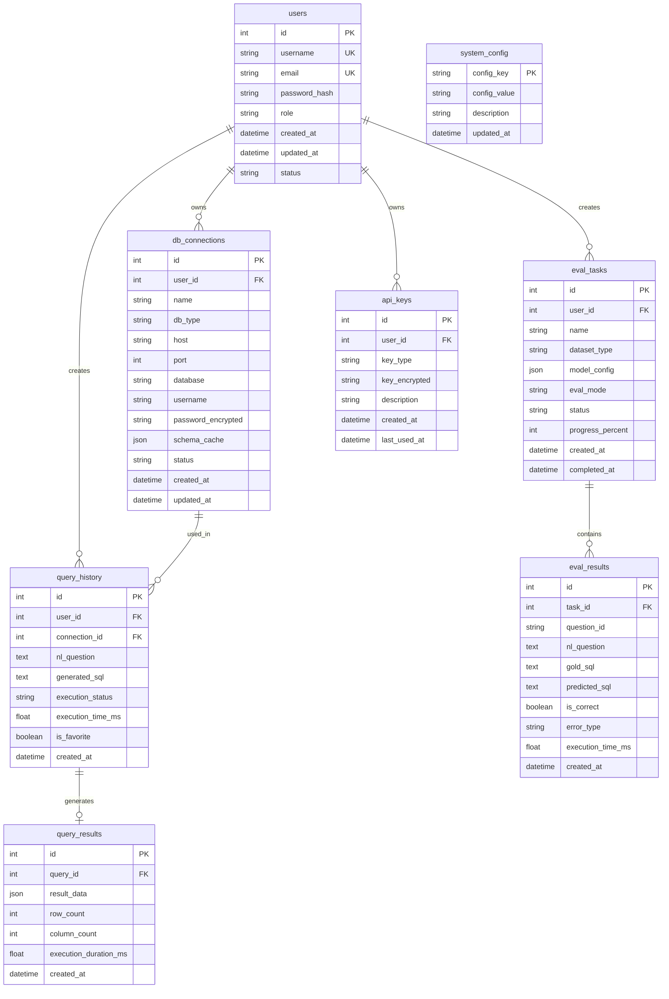

# 数据库设计文档

## 1. 概述

### 1.1 数据库选型

| 环境 | 数据库 | 说明 |
|------|--------|------|
| 开发环境 | SQLite | 轻量级、无需安装、便于快速开发 |
| 生产环境 | PostgreSQL | 功能强大、支持JSON、适合高并发 |

### 1.2 设计原则

1. **数据完整性**：通过外键约束确保数据一致性
2. **安全性**：敏感信息（密码、API密钥）加密存储
3. **可扩展性**：预留JSON字段支持动态配置
4. **性能优化**：合理设计索引支持常用查询场景

---

## 2. ER图（实体关系图）



---

## 3. 表结构详细设计

### 3.1 用户表 (users)

存储系统用户基本信息。

| 字段名 | 类型 | 约束 | 默认值 | 说明 |
|--------|------|------|--------|------|
| id | INTEGER | PRIMARY KEY, AUTO_INCREMENT | - | 用户ID |
| username | VARCHAR(50) | UNIQUE, NOT NULL | - | 用户名 |
| email | VARCHAR(100) | UNIQUE, NOT NULL | - | 邮箱地址 |
| password_hash | VARCHAR(255) | NOT NULL | - | 密码哈希（bcrypt加密） |
| role | VARCHAR(20) | NOT NULL | 'user' | 用户角色：admin/user |
| status | VARCHAR(20) | NOT NULL | 'active' | 状态：active/disabled |
| created_at | DATETIME | NOT NULL | CURRENT_TIMESTAMP | 创建时间 |
| updated_at | DATETIME | NOT NULL | CURRENT_TIMESTAMP | 更新时间 |

**索引设计**：
- PRIMARY KEY: `id`
- UNIQUE INDEX: `username`
- UNIQUE INDEX: `email`
- INDEX: `status` (用于按状态筛选用户)

---

### 3.2 数据库连接配置表 (db_connections)

存储用户的数据库连接信息。

| 字段名 | 类型 | 约束 | 默认值 | 说明 |
|--------|------|------|--------|------|
| id | INTEGER | PRIMARY KEY, AUTO_INCREMENT | - | 连接ID |
| user_id | INTEGER | FOREIGN KEY, NOT NULL | - | 所属用户ID |
| name | VARCHAR(100) | NOT NULL | - | 连接名称（用户自定义） |
| db_type | VARCHAR(20) | NOT NULL | - | 数据库类型：mysql/postgresql/sqlite/sqlserver |
| host | VARCHAR(255) | - | NULL | 主机地址 |
| port | INTEGER | - | NULL | 端口号 |
| database | VARCHAR(100) | - | NULL | 数据库名 |
| username | VARCHAR(100) | - | NULL | 连接用户名 |
| password_encrypted | TEXT | - | NULL | 加密后的密码 |
| schema_cache | JSON | - | NULL | Schema信息缓存（表结构） |
| status | VARCHAR(20) | NOT NULL | 'active' | 状态：active/inactive/error |
| created_at | DATETIME | NOT NULL | CURRENT_TIMESTAMP | 创建时间 |
| updated_at | DATETIME | NOT NULL | CURRENT_TIMESTAMP | 更新时间 |

**索引设计**：
- PRIMARY KEY: `id`
- FOREIGN KEY: `user_id` REFERENCES `users(id)` ON DELETE CASCADE
- INDEX: `user_id` (用于查询用户的所有连接)
- INDEX: `db_type` (用于按类型筛选连接)

---

### 3.3 查询历史表 (query_history)

存储自然语言查询记录。

| 字段名 | 类型 | 约束 | 默认值 | 说明 |
|--------|------|------|--------|------|
| id | INTEGER | PRIMARY KEY, AUTO_INCREMENT | - | 查询ID |
| user_id | INTEGER | FOREIGN KEY, NOT NULL | - | 用户ID |
| connection_id | INTEGER | FOREIGN KEY, NOT NULL | - | 使用的数据库连接ID |
| nl_question | TEXT | NOT NULL | - | 自然语言问题 |
| generated_sql | TEXT | - | NULL | 生成的SQL语句 |
| execution_status | VARCHAR(20) | NOT NULL | 'pending' | 执行状态：pending/success/failed |
| execution_time_ms | FLOAT | - | NULL | SQL执行耗时（毫秒） |
| is_favorite | BOOLEAN | NOT NULL | FALSE | 是否收藏 |
| error_message | TEXT | - | NULL | 错误信息（如执行失败） |
| created_at | DATETIME | NOT NULL | CURRENT_TIMESTAMP | 创建时间 |

**索引设计**：
- PRIMARY KEY: `id`
- FOREIGN KEY: `user_id` REFERENCES `users(id)` ON DELETE CASCADE
- FOREIGN KEY: `connection_id` REFERENCES `db_connections(id)` ON DELETE SET NULL
- INDEX: `user_id` (用于查询用户历史)
- INDEX: `connection_id` (用于查询连接相关的历史)
- INDEX: `created_at` (用于按时间排序)
- INDEX: `is_favorite` (用于筛选收藏记录)
- COMPOSITE INDEX: `(user_id, created_at)` (常用查询组合)

---

### 3.4 查询结果表 (query_results)

存储查询执行结果（可选，限制存储大小）。

| 字段名 | 类型 | 约束 | 默认值 | 说明 |
|--------|------|------|--------|------|
| id | INTEGER | PRIMARY KEY, AUTO_INCREMENT | - | 结果ID |
| query_id | INTEGER | FOREIGN KEY, UNIQUE, NOT NULL | - | 关联的查询ID |
| result_data | JSON | - | NULL | 查询结果数据（JSON格式） |
| row_count | INTEGER | - | NULL | 结果行数 |
| column_count | INTEGER | - | NULL | 结果列数 |
| execution_duration_ms | FLOAT | - | NULL | 执行时长（毫秒） |
| created_at | DATETIME | NOT NULL | CURRENT_TIMESTAMP | 创建时间 |

**索引设计**：
- PRIMARY KEY: `id`
- FOREIGN KEY: `query_id` REFERENCES `query_history(id)` ON DELETE CASCADE
- UNIQUE INDEX: `query_id` (一对一关系)

**存储策略**：
- 仅存储前N条结果（如100条）
- 结果数据大小限制（如1MB）
- 定期清理过期数据（如30天前）

---

### 3.5 评测任务表 (eval_tasks)

存储模型评测任务（参考ICED-2026评测需求）。

| 字段名 | 类型 | 约束 | 默认值 | 说明 |
|--------|------|------|--------|------|
| id | INTEGER | PRIMARY KEY, AUTO_INCREMENT | - | 任务ID |
| user_id | INTEGER | FOREIGN KEY, NOT NULL | - | 创建者用户ID |
| name | VARCHAR(200) | NOT NULL | - | 任务名称 |
| dataset_type | VARCHAR(50) | NOT NULL | - | 数据集类型：bird/spider/custom |
| dataset_path | VARCHAR(500) | - | NULL | 自定义数据集路径 |
| model_config | JSON | NOT NULL | - | 模型配置（模型路径、参数等） |
| eval_mode | VARCHAR(50) | NOT NULL | 'greedy_search' | 评估模式：greedy_search/major_voting/pass@k |
| status | VARCHAR(20) | NOT NULL | 'pending' | 任务状态：pending/running/completed/failed |
| progress_percent | INTEGER | NOT NULL | 0 | 进度百分比（0-100） |
| total_questions | INTEGER | - | NULL | 总问题数 |
| processed_questions | INTEGER | NOT NULL | 0 | 已处理问题数 |
| correct_count | INTEGER | - | NULL | 正确数 |
| accuracy | FLOAT | - | NULL | 准确率 |
| log_path | VARCHAR(500) | - | NULL | 评测日志路径 |
| error_message | TEXT | - | NULL | 错误信息 |
| created_at | DATETIME | NOT NULL | CURRENT_TIMESTAMP | 创建时间 |
| started_at | DATETIME | - | NULL | 开始时间 |
| completed_at | DATETIME | - | NULL | 完成时间 |

**索引设计**：
- PRIMARY KEY: `id`
- FOREIGN KEY: `user_id` REFERENCES `users(id)` ON DELETE CASCADE
- INDEX: `user_id` (用于查询用户的评测任务)
- INDEX: `status` (用于按状态筛选任务)
- INDEX: `dataset_type` (用于按数据集类型筛选)
- INDEX: `created_at` (用于按时间排序)

---

### 3.6 评测结果表 (eval_results)

存储评测结果详情。

| 字段名 | 类型 | 约束 | 默认值 | 说明 |
|--------|------|------|--------|------|
| id | INTEGER | PRIMARY KEY, AUTO_INCREMENT | - | 结果ID |
| task_id | INTEGER | FOREIGN KEY, NOT NULL | - | 所属任务ID |
| question_id | VARCHAR(100) | NOT NULL | - | 问题ID（数据集中的标识） |
| nl_question | TEXT | NOT NULL | - | 自然语言问题 |
| db_id | VARCHAR(100) | - | NULL | 数据库ID |
| gold_sql | TEXT | NOT NULL | - | 标准SQL（黄金答案） |
| predicted_sql | TEXT | - | NULL | 预测SQL（模型生成） |
| is_correct | BOOLEAN | - | NULL | 是否正确（0/1） |
| error_type | VARCHAR(50) | - | NULL | 错误类型：syntax/execution/logic/timeout |
| error_message | TEXT | - | NULL | 错误详情 |
| execution_time_ms | FLOAT | - | NULL | 执行时间（毫秒） |
| created_at | DATETIME | NOT NULL | CURRENT_TIMESTAMP | 创建时间 |

**索引设计**：
- PRIMARY KEY: `id`
- FOREIGN KEY: `task_id` REFERENCES `eval_tasks(id)` ON DELETE CASCADE
- INDEX: `task_id` (用于查询任务的所有结果)
- INDEX: `is_correct` (用于统计正确率)
- INDEX: `error_type` (用于分析错误分布)
- COMPOSITE INDEX: `(task_id, is_correct)` (常用统计查询)

---

### 3.7 API密钥表 (api_keys)

存储用户的LLM API密钥。

| 字段名 | 类型 | 约束 | 默认值 | 说明 |
|--------|------|------|--------|------|
| id | INTEGER | PRIMARY KEY, AUTO_INCREMENT | - | 密钥ID |
| user_id | INTEGER | FOREIGN KEY, NOT NULL | - | 所属用户ID |
| key_type | VARCHAR(50) | NOT NULL | - | 密钥类型：openai/alibaba/anthropic等 |
| key_encrypted | TEXT | NOT NULL | - | 加密后的API密钥 |
| description | VARCHAR(200) | - | NULL | 描述说明 |
| is_default | BOOLEAN | NOT NULL | FALSE | 是否为默认密钥 |
| created_at | DATETIME | NOT NULL | CURRENT_TIMESTAMP | 创建时间 |
| last_used_at | DATETIME | - | NULL | 最后使用时间 |

**索引设计**：
- PRIMARY KEY: `id`
- FOREIGN KEY: `user_id` REFERENCES `users(id)` ON DELETE CASCADE
- INDEX: `user_id` (用于查询用户的所有密钥)
- INDEX: `key_type` (用于按类型筛选密钥)
- INDEX: `is_default` (用于查询默认密钥)

---

### 3.8 系统配置表 (system_config)

存储系统级配置。

| 字段名 | 类型 | 约束 | 默认值 | 说明 |
|--------|------|------|--------|------|
| config_key | VARCHAR(100) | PRIMARY KEY | - | 配置键 |
| config_value | TEXT | - | NULL | 配置值 |
| description | VARCHAR(500) | - | NULL | 配置描述 |
| updated_at | DATETIME | NOT NULL | CURRENT_TIMESTAMP | 更新时间 |

**索引设计**：
- PRIMARY KEY: `config_key`

---

## 4. 数据字典

### 4.1 用户角色 (users.role)

| 取值 | 说明 |
|------|------|
| admin | 管理员，拥有所有权限 |
| user | 普通用户，只能访问自己的数据 |

### 4.2 用户状态 (users.status)

| 取值 | 说明 |
|------|------|
| active | 启用状态，可以正常登录 |
| disabled | 禁用状态，无法登录 |

### 4.3 数据库类型 (db_connections.db_type)

| 取值 | 说明 |
|------|------|
| mysql | MySQL数据库 |
| postgresql | PostgreSQL数据库 |
| sqlite | SQLite数据库 |
| sqlserver | SQL Server数据库 |
| oracle | Oracle数据库 |

### 4.4 连接状态 (db_connections.status)

| 取值 | 说明 |
|------|------|
| active | 连接正常可用 |
| inactive | 连接被禁用 |
| error | 连接异常（如认证失败） |

### 4.5 执行状态 (query_history.execution_status)

| 取值 | 说明 |
|------|------|
| pending | 待执行 |
| success | 执行成功 |
| failed | 执行失败 |

### 4.6 数据集类型 (eval_tasks.dataset_type)

| 取值 | 说明 |
|------|------|
| bird | BIRD数据集 |
| spider | Spider数据集 |
| custom | 自定义数据集 |

### 4.7 评估模式 (eval_tasks.eval_mode)

| 取值 | 说明 |
|------|------|
| greedy_search | 贪婪搜索（单次生成） |
| major_voting | 多数投票（多次生成取最频繁结果） |
| pass@k | Pass@K评估（K次中至少一次正确） |

### 4.8 任务状态 (eval_tasks.status)

| 取值 | 说明 |
|------|------|
| pending | 待执行 |
| running | 执行中 |
| completed | 已完成 |
| failed | 执行失败 |
| cancelled | 已取消 |

### 4.9 错误类型 (eval_results.error_type)

| 取值 | 说明 |
|------|------|
| syntax | SQL语法错误 |
| execution | SQL执行错误（如表不存在） |
| logic | 逻辑错误（结果不正确） |
| timeout | 执行超时 |
| generation | 生成失败（模型未返回有效SQL） |

### 4.10 API密钥类型 (api_keys.key_type)

| 取值 | 说明 |
|------|------|
| openai | OpenAI API |
| alibaba | 阿里云DashScope |
| anthropic | Anthropic Claude |
| azure_openai | Azure OpenAI |
| local | 本地模型（无需密钥） |

---

## 5. 索引策略

### 5.1 索引设计原则

1. **主键索引**：所有表使用自增ID作为主键
2. **外键索引**：所有外键字段建立索引，加速JOIN查询
3. **业务查询索引**：根据常用查询场景建立复合索引
4. **唯一索引**：确保业务唯一性（如用户名、邮箱）

### 5.2 核心查询场景与索引

| 查询场景 | 涉及的表 | 索引策略 |
|----------|----------|----------|
| 用户登录验证 | users | username/email唯一索引 |
| 查询用户的数据库连接 | db_connections | user_id索引 |
| 查询用户的查询历史 | query_history | (user_id, created_at)复合索引 |
| 查询收藏的查询 | query_history | (user_id, is_favorite)复合索引 |
| 查询任务的评测结果 | eval_results | task_id索引 |
| 统计任务正确率 | eval_results | (task_id, is_correct)复合索引 |
| 查询用户的API密钥 | api_keys | (user_id, is_default)复合索引 |

---

## 6. 数据量估算

### 6.1 各表预期数据量

| 表名 | 单条记录大小 | 预期数据量 | 增长策略 |
|------|-------------|-----------|----------|
| users | ~200 bytes | 1,000 - 10,000 | 缓慢增长 |
| db_connections | ~500 bytes | 5,000 - 50,000 | 中等增长 |
| query_history | ~2 KB | 100,000 - 1,000,000 | 快速增长 |
| query_results | ~10 KB | 100,000 - 500,000 | 快速增长，需定期清理 |
| eval_tasks | ~1 KB | 1,000 - 10,000 | 中等增长 |
| eval_results | ~3 KB | 100,000 - 1,000,000 | 快速增长，可归档 |
| api_keys | ~300 bytes | 2,000 - 20,000 | 缓慢增长 |
| system_config | ~200 bytes | < 100 | 基本不变 |

### 6.2 存储空间估算

以10,000活跃用户、每人每天10次查询估算：

| 数据类型 | 日增长量 | 月增长量 | 年增长量 |
|----------|---------|---------|---------|
| 查询历史 | ~20 MB | ~600 MB | ~7 GB |
| 查询结果 | ~100 MB | ~3 GB | ~36 GB |
| 评测结果 | 视使用频率 | - | ~10 GB |

### 6.3 数据清理策略

| 表名 | 清理策略 | 保留期限 |
|------|---------|----------|
| query_results | 定期清理 | 30天 |
| query_history | 归档或清理 | 90天（非收藏） |
| eval_results | 归档到对象存储 | 任务完成后7天 |

### 6.4 分区建议（PostgreSQL）

对于大数据量表，建议按时间分区：

```sql
-- query_history按月份分区
CREATE TABLE query_history_2024_01 PARTITION OF query_history
    FOR VALUES FROM ('2024-01-01') TO ('2024-02-01');

-- eval_results按任务ID分区
CREATE TABLE eval_results_task_1 PARTITION OF eval_results
    FOR VALUES IN (1);
```

---

## 7. SQL DDL（SQLite版本）

```sql
-- 用户表
CREATE TABLE users (
    id INTEGER PRIMARY KEY AUTOINCREMENT,
    username VARCHAR(50) UNIQUE NOT NULL,
    email VARCHAR(100) UNIQUE NOT NULL,
    password_hash VARCHAR(255) NOT NULL,
    role VARCHAR(20) NOT NULL DEFAULT 'user',
    status VARCHAR(20) NOT NULL DEFAULT 'active',
    created_at DATETIME NOT NULL DEFAULT CURRENT_TIMESTAMP,
    updated_at DATETIME NOT NULL DEFAULT CURRENT_TIMESTAMP
);

-- 数据库连接配置表
CREATE TABLE db_connections (
    id INTEGER PRIMARY KEY AUTOINCREMENT,
    user_id INTEGER NOT NULL,
    name VARCHAR(100) NOT NULL,
    db_type VARCHAR(20) NOT NULL,
    host VARCHAR(255),
    port INTEGER,
    database VARCHAR(100),
    username VARCHAR(100),
    password_encrypted TEXT,
    schema_cache JSON,
    status VARCHAR(20) NOT NULL DEFAULT 'active',
    created_at DATETIME NOT NULL DEFAULT CURRENT_TIMESTAMP,
    updated_at DATETIME NOT NULL DEFAULT CURRENT_TIMESTAMP,
    FOREIGN KEY (user_id) REFERENCES users(id) ON DELETE CASCADE
);
CREATE INDEX idx_db_conn_user_id ON db_connections(user_id);
CREATE INDEX idx_db_conn_type ON db_connections(db_type);

-- 查询历史表
CREATE TABLE query_history (
    id INTEGER PRIMARY KEY AUTOINCREMENT,
    user_id INTEGER NOT NULL,
    connection_id INTEGER,
    nl_question TEXT NOT NULL,
    generated_sql TEXT,
    execution_status VARCHAR(20) NOT NULL DEFAULT 'pending',
    execution_time_ms FLOAT,
    is_favorite BOOLEAN NOT NULL DEFAULT 0,
    error_message TEXT,
    created_at DATETIME NOT NULL DEFAULT CURRENT_TIMESTAMP,
    FOREIGN KEY (user_id) REFERENCES users(id) ON DELETE CASCADE,
    FOREIGN KEY (connection_id) REFERENCES db_connections(id) ON DELETE SET NULL
);
CREATE INDEX idx_query_history_user_id ON query_history(user_id);
CREATE INDEX idx_query_history_conn_id ON query_history(connection_id);
CREATE INDEX idx_query_history_created_at ON query_history(created_at);
CREATE INDEX idx_query_history_favorite ON query_history(is_favorite);
CREATE INDEX idx_query_history_user_created ON query_history(user_id, created_at);

-- 查询结果表
CREATE TABLE query_results (
    id INTEGER PRIMARY KEY AUTOINCREMENT,
    query_id INTEGER UNIQUE NOT NULL,
    result_data JSON,
    row_count INTEGER,
    column_count INTEGER,
    execution_duration_ms FLOAT,
    created_at DATETIME NOT NULL DEFAULT CURRENT_TIMESTAMP,
    FOREIGN KEY (query_id) REFERENCES query_history(id) ON DELETE CASCADE
);

-- 评测任务表
CREATE TABLE eval_tasks (
    id INTEGER PRIMARY KEY AUTOINCREMENT,
    user_id INTEGER NOT NULL,
    name VARCHAR(200) NOT NULL,
    dataset_type VARCHAR(50) NOT NULL,
    dataset_path VARCHAR(500),
    model_config JSON NOT NULL,
    eval_mode VARCHAR(50) NOT NULL DEFAULT 'greedy_search',
    status VARCHAR(20) NOT NULL DEFAULT 'pending',
    progress_percent INTEGER NOT NULL DEFAULT 0,
    total_questions INTEGER,
    processed_questions INTEGER NOT NULL DEFAULT 0,
    correct_count INTEGER,
    accuracy FLOAT,
    log_path VARCHAR(500),
    error_message TEXT,
    created_at DATETIME NOT NULL DEFAULT CURRENT_TIMESTAMP,
    started_at DATETIME,
    completed_at DATETIME,
    FOREIGN KEY (user_id) REFERENCES users(id) ON DELETE CASCADE
);
CREATE INDEX idx_eval_tasks_user_id ON eval_tasks(user_id);
CREATE INDEX idx_eval_tasks_status ON eval_tasks(status);
CREATE INDEX idx_eval_tasks_dataset ON eval_tasks(dataset_type);

-- 评测结果表
CREATE TABLE eval_results (
    id INTEGER PRIMARY KEY AUTOINCREMENT,
    task_id INTEGER NOT NULL,
    question_id VARCHAR(100) NOT NULL,
    nl_question TEXT NOT NULL,
    db_id VARCHAR(100),
    gold_sql TEXT NOT NULL,
    predicted_sql TEXT,
    is_correct BOOLEAN,
    error_type VARCHAR(50),
    error_message TEXT,
    execution_time_ms FLOAT,
    created_at DATETIME NOT NULL DEFAULT CURRENT_TIMESTAMP,
    FOREIGN KEY (task_id) REFERENCES eval_tasks(id) ON DELETE CASCADE
);
CREATE INDEX idx_eval_results_task_id ON eval_results(task_id);
CREATE INDEX idx_eval_results_correct ON eval_results(is_correct);
CREATE INDEX idx_eval_results_error ON eval_results(error_type);

-- API密钥表
CREATE TABLE api_keys (
    id INTEGER PRIMARY KEY AUTOINCREMENT,
    user_id INTEGER NOT NULL,
    key_type VARCHAR(50) NOT NULL,
    key_encrypted TEXT NOT NULL,
    description VARCHAR(200),
    is_default BOOLEAN NOT NULL DEFAULT 0,
    created_at DATETIME NOT NULL DEFAULT CURRENT_TIMESTAMP,
    last_used_at DATETIME,
    FOREIGN KEY (user_id) REFERENCES users(id) ON DELETE CASCADE
);
CREATE INDEX idx_api_keys_user_id ON api_keys(user_id);
CREATE INDEX idx_api_keys_type ON api_keys(key_type);

-- 系统配置表
CREATE TABLE system_config (
    config_key VARCHAR(100) PRIMARY KEY,
    config_value TEXT,
    description VARCHAR(500),
    updated_at DATETIME NOT NULL DEFAULT CURRENT_TIMESTAMP
);
```

---

## 8. 安全考虑

### 8.1 数据加密

| 数据类型 | 加密方式 | 说明 |
|----------|---------|------|
| 用户密码 | bcrypt哈希 | 不可逆加密 |
| 数据库连接密码 | AES加密 | 可逆加密，需要密钥管理 |
| API密钥 | AES加密 | 可逆加密，需要密钥管理 |

### 8.2 访问控制

- 用户只能访问自己的数据（通过user_id过滤）
- 管理员可以访问所有数据
- 敏感操作需要额外验证

### 8.3 审计日志

建议记录以下操作：
- 用户登录/登出
- 数据库连接的创建/修改/删除
- API密钥的使用
- 评测任务的创建和执行

---

## 9. 版本历史

| 版本 | 日期 | 修改内容 | 作者 |
|------|------|---------|------|
| 1.0 | 2026-03-12 | 初始版本 | Database Architect |
