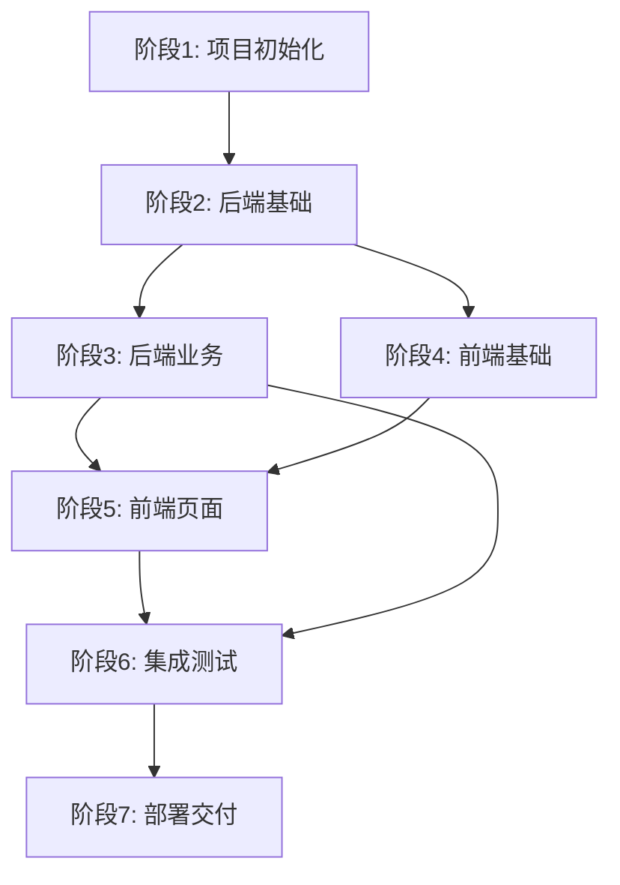

# Text-to-SQL 原型项目 - 总体开发规划

## 项目概述

基于已完成的7个阶段文档，本项目进入实施阶段。采用**分阶段迭代**开发模式，每个阶段交付可运行的功能。

---

## 技术栈确认

| 层级 | 技术 | 版本 |
|------|------|------|
| 前端 | Vue 3 + TypeScript + Element Plus | ^3.4.x |
| 构建工具 | Vite | ^5.x |
| 状态管理 | Pinia | ^2.1.x |
| 后端 | FastAPI + Python | ^0.109.x |
| ORM | SQLAlchemy + Alembic | ^2.0.x |
| 数据库 | SQLite(开发) / PostgreSQL(生产) | - |
| 任务队列 | Celery + Redis | ^5.3.x |
| LLM服务 | OpenAI API / 阿里云 DashScope | - |

---

## 开发阶段总览

```
阶段1: 项目初始化
    │
    ├── 后端Agent: 项目结构、依赖配置
    ├── 前端Agent: 项目结构、依赖配置
    └── Test Agent: 项目结构验证
    │
阶段2: 后端基础架构
    │
    ├── 数据库Agent: 模型定义、迁移脚本
    ├── 认证Agent: JWT认证、用户模块
    ├── 核心Agent: 配置管理、日志、异常处理
    └── Test Agent: API集成测试（反馈-修复循环）
    │
阶段3: 后端核心业务
    │
    ├── 数据库连接Agent: 连接管理、Schema获取
    ├── Text-to-SQL Agent: SQL生成、执行
    ├── 评测Agent: 评测任务、EX准确率计算
    └── Test Agent: 核心业务集成测试（反馈-修复循环）
    │
阶段4: 前端基础架构
    │
    ├── 基础Agent: 路由、状态管理、HTTP客户端
    ├── 组件Agent: 布局组件、通用组件库
    └── Test Agent: 前端架构验证测试
    │
阶段5: 前端页面开发
    │
    ├── 查询页面Agent: NL2SQL核心界面
    ├── 连接管理Agent: 数据库连接页面
    ├── 评测管理Agent: 评测控制台
    └── Test Agent: E2E测试（反馈-修复循环）
    │
阶段6: 集成测试
    │
    ├── Test Agent: 全面API测试、E2E测试
    ├── Test Agent: Bug报告与跟踪
    ├── 开发Agent: Bug修复（响应测试反馈）
    └── Test Agent: 回归测试验证
    │
阶段7: 部署交付
    │
    ├── DevOps Agent: Docker配置、CI/CD、文档
    └── Test Agent: 部署验证测试
```

---

## Agent 角色定义

| Agent名称 | 职责 | 所需技能 | 参与阶段 |
|-----------|------|----------|----------|
| `backend-dev` | 后端业务开发 | FastAPI, SQLAlchemy, Python | 2, 3, 6 |
| `frontend-dev` | 前端页面开发 | Vue3, TypeScript, Element Plus | 4, 5, 6 |
| `database-dev` | 数据库设计与迁移 | SQLAlchemy, Alembic, SQL | 2 |
| `auth-dev` | 认证与权限 | JWT, 安全 | 2 |
| `ui-component-dev` | 前端组件开发 | Vue3, UI设计 | 4 |
| `tester` | **专用测试Agent**，执行集成测试、反馈问题、跟踪修复 | pytest, Playwright, 测试设计 | **所有阶段** |
| `devops` | 部署与运维 | Docker, CI/CD | 1, 7 |

### Test Agent 特殊职责（重要）

**Test Agent 是每个阶段的质量守门员**：

1. **测试执行**: 按照阶段计划中的集成测试计划执行测试
2. **问题反馈**: 测试失败时，向负责的开发Agent发送详细错误报告
3. **修复跟踪**: 跟踪开发Agent的修复进度，重新测试验证
4. **循环直到通过**: 测试不通过则持续反馈-修复循环，直到所有测试通过
5. **报告输出**: 输出测试报告，记录测试覆盖率、问题列表、修复历史

**测试反馈流程**:
```
开发Agent完成任务
    ↓
Test Agent 执行集成测试
    ├─ 通过 → 阶段完成，输出报告
    └─ 失败 → 发送详细错误报告给开发Agent
              ↓
        开发Agent修复问题
              ↓
        Test Agent 重新测试
              ├─ 通过 → 阶段完成
              └─ 失败 → 继续反馈修复（循环）
```

---

## 阶段依赖关系



---

## 交付物检查清单

每个阶段必须完成以下检查才能进入下一阶段：

### ✅ 代码检查
- [ ] 代码符合项目规范
- [ ] 通过静态代码检查（eslint, flake8）
- [ ] 关键代码有注释

### ✅ 功能检查
- [ ] 阶段规划的功能全部实现
- [ ] 通过单元测试（覆盖率>70%）
- [ ] 通过集成测试

### ✅ 集成测试要求（每个阶段）

每个阶段完成后必须进行集成测试验证：

| 阶段 | 集成测试方式 | 负责Agent | 验证标准 |
|------|-------------|-----------|----------|
| **Phase 1** | 项目结构检查 + 依赖安装 | `tester` | 前后端项目能独立启动，无报错 |
| **Phase 2** | Python 测试脚本 | `tester` | 所有 API 返回预期结果，数据库操作正常 |
| **Phase 3** | Python 测试脚本 + curl 测试 | `tester` | Text-to-SQL 流程完整运行，评测功能正常 |
| **Phase 4** | 前端页面渲染检查 | `tester` | 所有页面路由可访问，组件正常显示 |
| **Phase 5** | 浏览器访问 + 前端功能测试 | `tester` | 完整业务流程可运行（登录→查询→结果） |
| **Phase 6** | 端到端自动化测试 | `tester` | 所有用户场景测试通过 |
| **Phase 7** | Docker 构建 + 部署验证 | `tester` | 容器能正常启动，服务可访问 |

**集成测试必须包含**：
1. **真实运行验证** - 实际启动程序，非 mock
2. **端到端流程** - 从输入到输出的完整链路
3. **错误场景** - 异常情况的处理验证
4. **测试-反馈-修复循环** - 测试失败则反馈给开发Agent修复，直到通过
5. **测试报告** - 记录测试步骤、结果、截图

### ✅ 文档检查
- [ ] API文档更新（FastAPI自动文档）
- [ ] 集成测试报告（docs/report/）
- [ ] 更新CHANGELOG

---

## 测试-反馈-修复循环机制（关键流程）

### 流程说明

每个阶段的开发遵循以下循环机制，确保代码质量：

```
┌─────────────────────────────────────────────────────────────┐
│                    测试-反馈-修复循环                        │
├─────────────────────────────────────────────────────────────┤
│                                                             │
│   ┌──────────┐     ┌──────────┐     ┌──────────┐           │
│   │ 开发Agent │────→│ 提交测试 │────→│ Test Agent│           │
│   │ 实现功能  │     │          │     │ 执行测试  │           │
│   └──────────┘     └──────────┘     └────┬─────┘           │
│                                          │                  │
│                               ┌─────────┴─────────┐        │
│                               ↓                   ↓        │
│                         ┌──────────┐        ┌──────────┐   │
│                         │ 测试通过 │        │ 测试失败 │   │
│                         └────┬─────┘        └────┬─────┘   │
│                              │                   │         │
│                              ↓                   ↓         │
│                        ┌──────────┐      ┌──────────────┐  │
│                        │ 阶段完成 │      │ 发送错误报告 │  │
│                        │ 输出报告 │      │ 给开发Agent  │  │
│                        └──────────┘      └──────┬───────┘  │
│                                                  │         │
│                                                  ↓         │
│                                           ┌──────────┐    │
│                                           │ 开发Agent │    │
│                                           │ 修复问题  │────┘
│                                           └──────────┘    │
│                                                             │
└─────────────────────────────────────────────────────────────┘
```

### Test Agent 工作流程

1. **接收测试任务**: Leader分配测试任务和对应的开发Agent
2. **执行测试**: 按照阶段集成测试计划执行测试
3. **判断结果**:
   - **通过**: 更新检查点，输出测试报告
   - **失败**: 准备详细错误报告
4. **反馈问题**: 使用SendMessage向开发Agent发送错误报告
5. **等待修复**: 开发Agent修复完成后通知Test Agent
6. **重新测试**: 验证修复是否成功
7. **循环**: 如果不通过，继续反馈，直到全部通过

### 错误报告格式

Test Agent 必须提供以下格式的错误报告：

```markdown
【测试反馈】任务 X.X - 测试未通过

测试项: [测试名称]
状态: ❌ 失败
严重程度: [P0/P1/P2]

预期结果:
[描述期望的行为]

实际结果:
[描述实际发生的行为]

错误信息:
```
[详细的错误日志、堆栈跟踪]
```

复现步骤:
1. [步骤1]
2. [步骤2]
3. [步骤3]

相关代码位置:
- 文件: [文件路径]
- 函数/行号: [具体位置]

建议修复方向:
[可选：提供修复建议或思路]

请修复后回复此消息，Test Agent将重新测试。
```

---

## 风险与应对

| 风险 | 概率 | 影响 | 应对策略 |
|------|------|------|----------|
| LLM API不稳定 | 中 | 高 | 支持多提供商切换 |
| SQL生成准确率低 | 中 | 高 | Schema增强+Few-shot |
| 数据库连接安全 | 低 | 高 | 只读账号+密码加密 |
| 性能瓶颈 | 中 | 中 | 异步处理+缓存 |
| 测试-修复循环耗时过长 | 中 | 中 | 明确验收标准，开发Agent自测后再提交 |

---

## 参考文档

- PRD: `../01-PRD.md`
- UI设计: `../02-UI-Design.md`
- 业务逻辑: `../03-Business-Logic.md`
- 数据库设计: `../04-Database-Design.md`
- API文档: `../05-API-Documentation.md`
- 技术架构: `../06-Technical-Architecture.md`
- 部署文档: `../07-README-Deployment.md`

---

*规划创建时间: 2026-03-12*
*版本: v1.1 - 更新：添加Test Agent和测试-反馈-修复循环机制*
