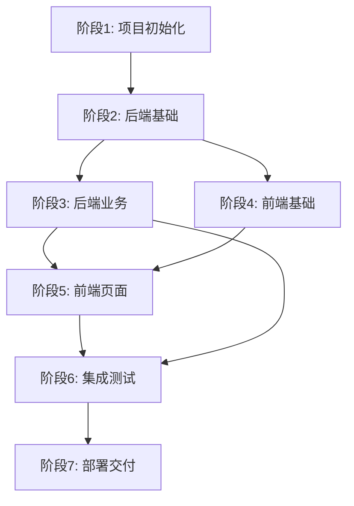

# Text-to-SQL 原型项目 - 总体开发规划

## 项目概述

基于已完成的7个阶段文档，本项目进入实施阶段。采用**分阶段迭代**开发模式，每个阶段交付可运行的功能。

---

## 技术栈确认

| 层级 | 技术 | 版本 |
|------|------|------|
| 前端 | Vue 3 + TypeScript + Element Plus | ^3.4.x |
| 构建工具 | Vite | ^5.x |
| 状态管理 | Pinia | ^2.1.x |
| 后端 | FastAPI + Python | ^0.109.x |
| ORM | SQLAlchemy + Alembic | ^2.0.x |
| 数据库 | SQLite(开发) / PostgreSQL(生产) | - |
| 任务队列 | Celery + Redis | ^5.3.x |
| LLM服务 | OpenAI API / 阿里云 DashScope | - |

---

## 开发阶段总览

```
阶段1: 项目初始化
    │
    ├── 后端Agent: 项目结构、依赖配置
    └── 前端Agent: 项目结构、依赖配置
    │
阶段2: 后端基础架构
    │
    ├── 数据库Agent: 模型定义、迁移脚本
    ├── 认证Agent: JWT认证、用户模块
    └── 核心Agent: 配置管理、日志、异常处理
    │
阶段3: 后端核心业务
    │
    ├── 数据库连接Agent: 连接管理、Schema获取
    ├── Text-to-SQL Agent: SQL生成、执行
    └── 评测Agent: 评测任务、EX准确率计算
    │
阶段4: 前端基础架构
    │
    ├── 基础Agent: 路由、状态管理、HTTP客户端
    └── 组件Agent: 布局组件、通用组件库
    │
阶段5: 前端页面开发
    │
    ├── 查询页面Agent: NL2SQL核心界面
    ├── 连接管理Agent: 数据库连接页面
    └── 评测管理Agent: 评测控制台
    │
阶段6: 集成测试
    │
    ├── 测试Agent: API测试、E2E测试
    └── 优化Agent: 性能优化、Bug修复
    │
阶段7: 部署交付
    │
    └── DevOps Agent: Docker配置、CI/CD、文档
```

---

## Agent 角色定义

| Agent名称 | 职责 | 所需技能 |
|-----------|------|----------|
| `backend-dev` | 后端业务开发 | FastAPI, SQLAlchemy, Python |
| `frontend-dev` | 前端页面开发 | Vue3, TypeScript, Element Plus |
| `database-dev` | 数据库设计与迁移 | SQLAlchemy, Alembic, SQL |
| `auth-dev` | 认证与权限 | JWT, 安全 |
| `ui-component-dev` | 前端组件开发 | Vue3, UI设计 |
| `tester` | 测试 | pytest, Playwright |
| `devops` | 部署与运维 | Docker, CI/CD |

---

## 阶段依赖关系



---

## 交付物检查清单

每个阶段必须完成以下检查才能进入下一阶段：

### ✅ 代码检查
- [ ] 代码符合项目规范
- [ ] 通过静态代码检查（eslint, flake8）
- [ ] 关键代码有注释

### ✅ 功能检查
- [ ] 阶段规划的功能全部实现
- [ ] 通过单元测试（覆盖率>70%）
- [ ] 通过集成测试

### ✅ 文档检查
- [ ] API文档更新（FastAPI自动文档）
- [ ] 更新CHANGELOG

---

## 风险与应对

| 风险 | 概率 | 影响 | 应对策略 |
|------|------|------|----------|
| LLM API不稳定 | 中 | 高 | 支持多提供商切换 |
| SQL生成准确率低 | 中 | 高 | Schema增强+Few-shot |
| 数据库连接安全 | 低 | 高 | 只读账号+密码加密 |
| 性能瓶颈 | 中 | 中 | 异步处理+缓存 |

---

## 参考文档

- PRD: `../01-PRD.md`
- UI设计: `../02-UI-Design.md`
- 业务逻辑: `../03-Business-Logic.md`
- 数据库设计: `../04-Database-Design.md`
- API文档: `../05-API-Documentation.md`
- 技术架构: `../06-Technical-Architecture.md`
- 部署文档: `../07-README-Deployment.md`

---

*规划创建时间: 2026-03-12*
*版本: v1.0*
