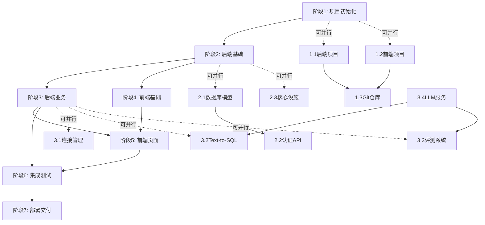

# Text-to-SQL 原型项目 - 开发计划文档

## 文档结构

```
docs/plan/
├── README.md                      # 本文档
├── 00-Master-Plan.md              # 总体任务规划
├── 01-Phase1-Project-Setup.md     # 阶段1：项目初始化
├── 02-Phase2-Backend-Foundation.md # 阶段2：后端基础架构
├── 03-Phase3-Backend-Core.md      # 阶段3：后端核心业务
├── 04-Phase4-Frontend-Foundation.md # 阶段4：前端基础架构
├── 05-Phase5-Frontend-Pages.md    # 阶段5：前端页面开发
├── 06-Phase6-Integration-Test.md  # 阶段6：集成测试
└── 07-Phase7-Deployment.md        # 阶段7：部署交付
```

---

## 如何使用这些计划

### 1. 总体了解
首先阅读 `00-Master-Plan.md` 了解：
- 项目技术栈
- 开发阶段划分
- Agent角色定义
- 阶段依赖关系

### 2. 按阶段执行
每个阶段文档包含：
- **阶段目标**：本阶段要达成的目标
- **任务分解**：可并行的任务及Agent分配
- **依赖关系**：任务之间的依赖
- **检查点**：如何验证任务完成
- **测试点**：如何测试功能

### 3. 使用Agent Team执行

#### Agent角色分配

| Agent名称 | 主要职责 | 使用场景 |
|-----------|----------|----------|
| `backend-dev` | 后端业务开发 | 阶段2、3、6的后端任务 |
| `frontend-dev` | 前端页面开发 | 阶段4、5、6的前端任务 |
| `database-dev` | 数据库设计 | 阶段2的数据库模型 |
| `auth-dev` | 认证与权限 | 阶段2的认证模块 |
| `ui-component-dev` | 前端组件 | 阶段4的通用组件 |
| `tester` | 测试 | 阶段6的所有测试任务 |
| `devops` | 部署运维 | 阶段1的环境配置、阶段7的部署 |

#### 执行示例

**阶段1（项目初始化）**：
```
并行启动：
- backend-dev → Task 1.1 (后端项目初始化)
- frontend-dev → Task 1.2 (前端项目初始化)

等待1.1、1.2完成后：
- backend-dev + frontend-dev → Task 1.3 (Git仓库初始化)
```

**阶段2（后端基础）**：
```
并行启动：
- database-dev → Task 2.1 (数据库模型)
- backend-dev → Task 2.3 (核心基础设施)

等待2.1完成后：
- auth-dev → Task 2.2 (认证与用户API)
```

---

## 阶段依赖关系图



---

## 每个阶段的入口条件

| 阶段 | 前置条件 | 预计工期 |
|------|----------|----------|
| 阶段1 | 无 | 0.5天 |
| 阶段2 | 阶段1完成 | 1天 |
| 阶段3 | 阶段2完成 | 2天 |
| 阶段4 | 阶段1完成，阶段2进行中 | 1天 |
| 阶段5 | 阶段4完成 | 2天 |
| 阶段6 | 阶段3、5完成 | 1.5天 |
| 阶段7 | 阶段6完成 | 1天 |

**总计：约9天**

---

## 参考文档

每个阶段计划都引用了项目文档：

| 阶段 | 主要参考文档 |
|------|-------------|
| 阶段1 | `../06-Technical-Architecture.md` |
| 阶段2 | `../04-Database-Design.md`, `../05-API-Documentation.md` |
| 阶段3 | `../03-Business-Logic.md`, `../05-API-Documentation.md` |
| 阶段4 | `../02-UI-Design.md`, `../05-API-Documentation.md` |
| 阶段5 | `../02-UI-Design.md` |
| 阶段6 | 所有前期文档 |
| 阶段7 | `../07-README-Deployment.md` |

---

## 检查点说明

每个任务都包含三类检查点：

### 1. 功能检查
- 功能是否按预期工作
- 边界情况处理是否正确
- 错误处理是否完善

### 2. 代码检查
- 代码是否符合项目规范
- 是否通过静态检查（ESLint, flake8）
- 关键代码是否有注释

### 3. 测试检查
- 是否编写了测试用例
- 测试是否通过
- 覆盖率是否达标

---

## 使用建议

### 对于项目管理者
1. 使用 `00-Master-Plan.md` 了解整体规划
2. 按阶段检查每个阶段的完成情况
3. 使用检查点验证交付物

### 对于开发人员（Agent）
1. 查看分配给你的阶段文档
2. 了解任务的依赖关系
3. 按检查点逐步完成任务
4. 完成后标记检查点

### 对于测试人员
1. 重点关注阶段6的测试任务
2. 每个阶段的测试点提供了测试思路
3. 编写测试用例时参考测试点

---

## 更新记录

| 版本 | 日期 | 修改内容 |
|------|------|----------|
| v1.0 | 2026-03-12 | 初始版本 |

---

*这些计划文档是为了让AI Agent能够高效协作，请确保每个Agent都清楚自己的任务和依赖关系。*
